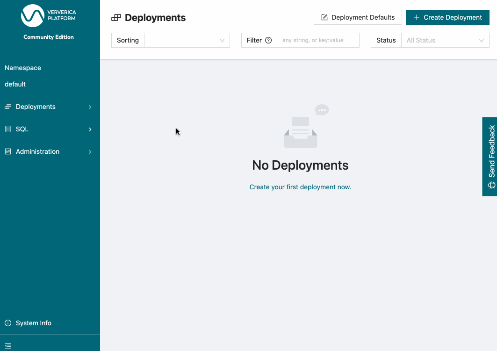

[](https://travis-ci.com/knaufk/flink-faker)

# flink-faker

flink-faker is an Apache Flink [table source](https://ci.apache.org/projects/flink/flink-docs-release-1.11/dev/table/connectors/) 
that generates fake data based on the [Java Faker](https://github.com/DiUS/java-faker) expression 
provided for each column.

Checkout this [demo web application](https://java-faker.herokuapp.com/) for some example Java Faker expressions.   

This project is inspired by [voluble](https://github.com/MichaelDrogalis/voluble). 

## Package

```shell script
mvn clean package
```

## Adding flink-faker to Flink SQL Client

1. Download Flink from the [Apache Flink website](https://flink.apache.org/downloads.html).
2. Download the flink-faker JAR from the [Releases](https://github.com/knaufk/flink-faker/releases) page (or [build it yourself](#package)).
3. Put the downloaded jars under `FLINK_HOME/lib/`.
4. (Re)Start a [Flink cluster](https://ci.apache.org/projects/flink/flink-docs-stable/docs/try-flink/local_installation/#step-2-start-a-cluster).
5. (Re)Start the [Flink CLI](https://ci.apache.org/projects/flink/flink-docs-stable/docs/dev/table/sqlclient/).

## Adding flink-faker to Ververica Platform

1. [Setup Ververica Platform](https://docs.ververica.com/getting_started/installation.html).
2. Download the flink-faker JAR from the [Releases](https://github.com/knaufk/flink-faker/releases) page (or [build it yourself](#package)).
3. Start Ververica Platorm > SQL > Connectors > Create Connector. Select the downloaded JAR and finish the setup.  


## Usage

### As ScanTableSource

```sql
CREATE TEMPORARY TABLE heros (
  `name` STRING,
  `power` STRING, 
  `age` INT
) WITH (
  'connector' = 'faker', 
  'fields.name.expression' = '#{superhero.name}',
  'fields.power.expression' = '#{superhero.power}',
  'fields.power.null-rate' = '0.05',
  'fields.age.expression' = '#{number.numberBetween ''0'',''1000''}'
);

SELECT * FROM heros;
```

### As LookupTableSource

```sql
CREATE TEMPORARY TABLE location_updates (
  `character_id` INT,
  `location` STRING,
  `proctime` AS PROCTIME()
)
WITH (
  'connector' = 'faker', 
  'fields.character_id.expression' = '#{number.numberBetween ''0'',''100''}',
  'fields.location.expression' = '#{harry_potter.location}'
);

CREATE TEMPORARY TABLE characters (
  `character_id` INT,
  `name` STRING
)
WITH (
  'connector' = 'faker', 
  'fields.character_id.expression' = '#{number.numberBetween ''0'',''100''}',
  'fields.name.expression' = '#{harry_potter.characters}'
);

SELECT 
  c.character_id,
  l.location,
  c.name
FROM location_updates AS l
JOIN characters FOR SYSTEM_TIME AS OF proctime AS c
ON l.character_id = c.character_id;
```

Currently, the `faker` source supports the following data types:

* `CHAR` 
* `VARCHAR`
* `STRING`
* `TINYINT`
* `SMALLINT`
* `INTEGER`
* `BIGINT`
* `FLOAT`
* `DOUBLE`
* `DECIMAL`
* `BOOLEAN`
* `TIMESTAMP`

### Connector Options

Connector Option | Default | Description
-----------------|---------|-------------
`number-of-rows` | None    | The number of rows to produce. If this is options is set, the source is bounded otherwise it is unbounded and runs indefinitely.
`rows-per-second`| 10000   | The maximum rate at which the source produces records.
`fields.<field>.expression` | None | The [Java Faker](https://github.com/DiUS/java-faker) expression to generate the values for this field.
`fields.<field>.null-rate` | 0.0 | Fraction of rows for which this field is `null`

### On Timestamps

For rows of type `TIMESTAMP`, the corresponding Java Faker expression needs to return a timestamp formatted as `EEE MMM dd HH:mm:ss zzz yyyy`. 
Typically, you would use one of the following expressions: 

```
CREATE TEMPORARY TABLE timestamp_example (
  `timestamp1` TIMESTAMP(3),
  `timestamp2` TIMESTAMP(3)
)
WITH (
  'connector' = 'faker', 
  'fields.timestamp1.expression' = '#{date.past ''15'',''SECONDS''}',
  'fields.timestamp2.expression' = '#{date.past ''15'',''5'',''SECONDS''}'
);

SELECT * FROM timestamp_example;
```

For `timestamp1` Java Faker will generate a random timestamp that lies at most 15 seconds in the past. 
For `timestamp2` Java Faker will generate a random timestamp, that lies at most 15 seconds in the past, but at least 5 seconds. 

### "One Of" Columns

The Java Faker expression to pick a random value from a list of options is not straight forward to get right.
Actually, I did not manage to get ``Options.option`` work at all. 
As a workaround, I recommend using ``regexify`` for this use case. 

```sql
CREATE TEMPORARY TABLE orders (
  `order_id` INT,
  `order_status` STRING
)
WITH (
  'connector' = 'faker', 
  'fields.order_id.expression' = '#{number.numberBetween ''0'',''100''}',
  'fields.order_status.expression' = '#{regexify ''(RECEIVED|SHIPPED|CANCELLED){1}''}'
);

SELECT * FROM orders;
```

## License 

Copyright © 2020-2021 Konstantin Knauf

Distributed under Apache License, Version 2.0.
